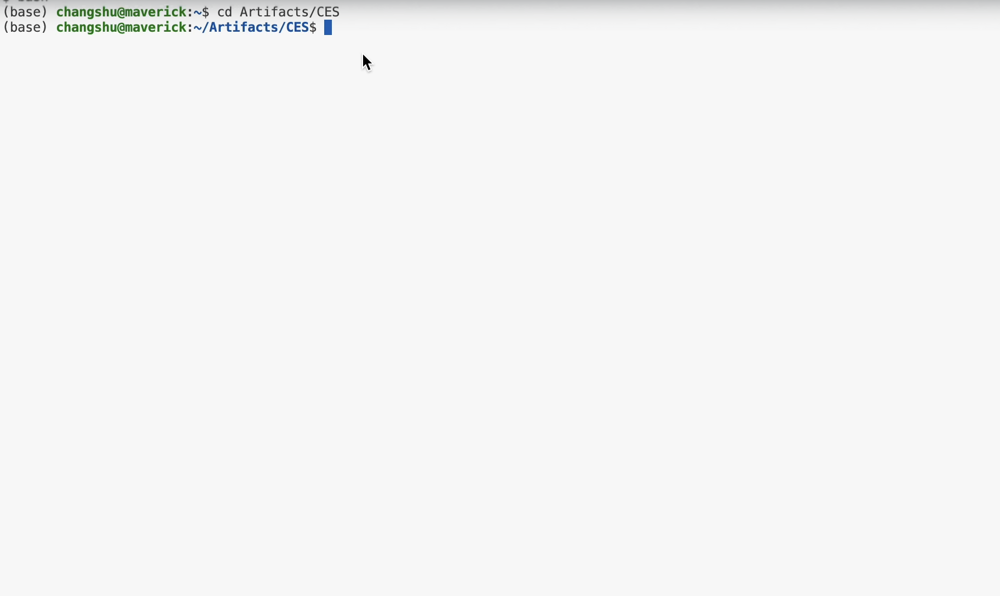

# Assessing Coherency and Consistency of Code Execution Reasoning by Large Language Models
Artifact for the paper [Assessing Coherency and Consistency of Code Execution Reasoning by Large Language Models](https://arxiv.org/abs/2510.15079), accepted by  the 48th IEEE/ACM International Conference on Software Engineering ([ICSE 2026](https://conf.researchr.org/home/icse-2026)).
Authors are [Changshu Liu](https://topgunlcs98.github.io/profile/), [Yang Chen](https://yangc9.github.io), and [Reyhaneh Jabbarvand](https://reyhaneh.cs.illinois.edu).

<p align="center">
<a href="#-run-ces">🔥 Run CES</a>•
<a href="https://topgunlcs98.github.io/ces-leaderboard/">🏆 Leaderboard</a>
<a href="#-evaluate-new-models">⚙️ Evaluate New LLMs</a> • 
<a href="#️-add-new-datasets">⚙️ Add New Benchmarks</a> • 
<a href="#-citation">📝 Citation</a>
</p>

## 📋 Getting Started
**Step 0**.  Please start by cloning this repository:
```
git clone git@github.com:Intelligent-CAT-Lab/CES.git
```
**Step 1**. Run the following commands to install all the dependencies on your local machine:
```
conda create -n ces python=3.12
conda activate ces
cd CES
pip install -r requirements.txt
```

**Step 2.** Go to `config/model_config.json` and edit the file with your OpenAI/Google AI Studio key/DeepSeek key.

**Step 3.** Download the meta-data required by the experiments:
```
bash scripts/setup_data.sh
```

Alternatively, we provide a Dockerfile to reproduce the results of CES.
Please first finishi step 0, 2 and 3, then download [Docker](https://www.docker.com/) and execute the following commands to create a docker image and run the container in the interactive mode:

```
docker build -t ces .
docker run -it ces bash
```
> [!NOTE]
> If you are using MacOS with an Apple chip, please consider adding `--platform=linux/amd64` in `docker build`.

## 🔥 Run CES (**C**ode **E**xecuation **S**imulation)
We provided a demo video to walk through CES.👇
[](https://youtu.be/6tyOwASc_vw)
### RQ1. Performance in CES
To evaluate LLMs on CES, please run the folliwing command:
```
bash scripts/run_ces.sh $MODEL_ID $DATASET $CACHE_DIR
```

`MODEL_ID`: Currently CES supports following models:  ```codellama/CodeLlama-13b-Instruct-hf```, ```codellama/CodeLlama-13b-hf```,  ```codellama/CodeLlama-13b-Instruct-hf```,```codellama/CodeLlama-7b-hf```,  
```codellama/CodeLlama-7b-Instruct-hf```, ```codellama/CodeLlama-34b-Instruct-hf```, ```codellama/CodeLlama-13b-hf```,```deepseek-ai/deepseek-coder-6.7b-instruct```, ```deepseek-ai/deepseek-coder-33b-instruct```,```deepseek-ai/deepseek-coder-6.7b-base```, ```bigcode/starcoder2-15b```, ```gpt-4-turbo```,
```gemini/gemini-1.5-pro```, ```semcoder/semcoder_s```, ```deepseek-r1```, ```gemini/gemini-2.5-pro-preview-05-06```, ```o4-mini-2025-04-16```.

```CACHE_DIR```: the directory to save huggingface model checkpoints.

This command will print LLMs' reasoning coherency in the console as follows:
```
====== CO ======
(Coherent Reasoning, Correct Output),   Ratio
11 0.8194444444444444
01 0.09722222222222222
10 0.08333333333333333
====== LO ======
(Coherent Reasoning, Correct Output),   Ratio
01 0.3888888888888889
11 0.5555555555555556
10 0.05555555555555555
====== LC ======
(Coherent Reasoning, Correct Output),   Ratio
10 0.18666666666666668
01 0.4533333333333333
11 0.36
====== Other ======
(Coherent Reasoning, Correct Output),   Ratio
11 0.8805031446540881
10 0.08176100628930817
====== Overall ======
(Coherent Reasoning, Correct Output),   Ratio
01 0.25
11 0.6097560975609756
10 0.12804878048780488
``` 

### RQ2. Reasoning Consistency Across Tests
For each reasoning problem, you can find the covered prime paths corresponding to its input in `dataset/{$DATASET}/{$Problem_ID}/prime_path.json`

To reproduce the results in RQ2, please run the following command:
```
bash scripts/run_consistency.sh $MODEL_ID $DATASET
```
This command will print the summary of the reasoning consistency of the assessed LLM:
```
Strong Reasoning: 0.09146341463414634
Weak Reasoning: 0.6463414634146342
Random Reasoning: 0.2621951219512195
```

### RQ3. Diagnostic Analysis
After prompting LLMs on CES, run the follwoing command to locate the simulation divergence:
```
bash scripts/run_divergence_localization.sh $MODEL_ID $DATASET
```
Annlysis results will be written into `Experiment_Results/summary/incorrect_output/{model_id}_{dataset}.json`
And we will also print results, for example
```
V_l, I_l, P_c, B_c
======LO======
0_1_X_X: 1
1_0_X_X: 1
======CO======
X_X_0_0: 3
======LC======
0_1_X_X: 12
X_X_0_0: 11
0_0_X_X: 5
1_0_X_X: 7
```
Definations of symbols ($V_l$, $I_l$, $P_c$, and $B_c$) can be found in the RQ3 of the paper.

### RQ4. CES and Bug-Related Tasks
To compare an LLM’s performance on bug repair, bug prediction, bug localization, with CES, run:
```
bash scripts/run_bug_tasks.sh $MODEL_ID HumanEvalFix $CACHE_DIR
```
This command will print the performance of the LLMs on bug related tasks:
```
Bug Repair:0.93125
Bug Prediction:0.8875
Bug Localization:0.7125
```
Then use the following command to perform a reliable analysis of the model’s performance on bug-related tasks:
```
bash scripts/analyze_bug_tasks.sh $MODEL_ID HumanEvalFix
```

This command generate JSON reports under `./Experiment_Results/summary/bug_task_analysis`, and  print key statistics in the console, for example:
```
======Bug Repair gpt-4-turbo  HumanEvalFix ======
confident success: 44
suspicious success: 13
likely success: 57
incoherent: 32
======Bug Localization gpt-4-turbo  HumanEvalFix ======
confident success: 32
suspicious success: 9
likely success: 48
incoherent: 23
======Bug Prediction gpt-4-turbo  HumanEvalFix ======
confident success: 43
suspicious success: 13
likely success: 52
incoherent: 31
```

## ⚙️ Evaluate New Models
If you want to eleluate new LLMs with CES:

(1) Update the configuration in [model_config.json](./config/model_config.json)

(2) Add new prompts in [create_prompts.py](./src/ces/create_prompts.py), if necessary.

## ⚙️ Add new Datasets
The experiments in the paper are conducted with HumanEval/HuamanEvalPack dataset.
However, we also provide a pipeline to extract program properties supporting other Python benchmarks (e.r. CruxEval, MBPP, ClassEval, Avatar-Python):

First, please organize your datasets as below under `dataset`:
```
--{DATASET_NAME}
  |
  |__{Problem_ID_1}
  |  |
  |  |__main.py (the Python code snippet)
  |  |
  |  |__input.txt (the entry point of main.py)
  |  |
  |  |__output.txt (the expected output of main.py)
  |
  |__{Problem_ID_2} 
  |  |
  |  |__main.py (the Python code snippet)
  |  |
  |  |__input.txt (the entry point of main.py)
  |  |
  |  |__output.txt (the expected output of main.py)
  |
  .......
  |__{Problem_ID_N}
     |
     |....... 
```
Then run the following command:
```
bash scripts/extract_properties.sh $DATASET_NAME
```
Ground truth values of program properties will be exported to `dataset/summary`

To obtain the prime path coverage for each reasoing problem in the new dataset, run the following command:
```
bash script/extract_prime_path.sh $DATASET_NAME
```
You can check the generated control graph under `./src/prime_path_extraction/logs_{$DATASET_NAME}`.

## 📀 Artifiacts
Please download `CES-Artifact.zip` from our [Zenodo](https://zenodo.org/records/17451159) repo. We have organized our experiment results as follows:

1. RQ1: This directory contains results of LLMs on CES. We have uploaded json reports to show models' performance on each individual reasoning problem.
2. RQ2: This directory contains an excel file which includes statistics on the reasoning consistenncy of LLMs. We use this excel to create Figure 6 in the paper.
3. RQ3: This directory contains an excel sheet which includes detailed breakdown on LLMs' reasoning divergence. We use this excel to create Figure 7 in the paper.
4. RQ4: This direcory contains result of LLMs on CES, Bug Repair, Bug Localization, and Bug Prediction. We also uploaed json files to report models' performance on each problem in HumanEvalPack.
5. RQ5: This directory contains reports of LLMs' performance on REVAL and CodeMind.

## 📝 Citation
If you find this repository useful, please cite this as
```
@article{liu2025assessing,
  title={Assessing Coherency and Consistency of Code Execution Reasoning by Large Language Models},
  author={Liu, Changshu and Chen, Yang and Jabbarvand, Reyhaneh},
  journal={arXiv preprint arXiv:2510.15079},
  year={2025}
}
```

